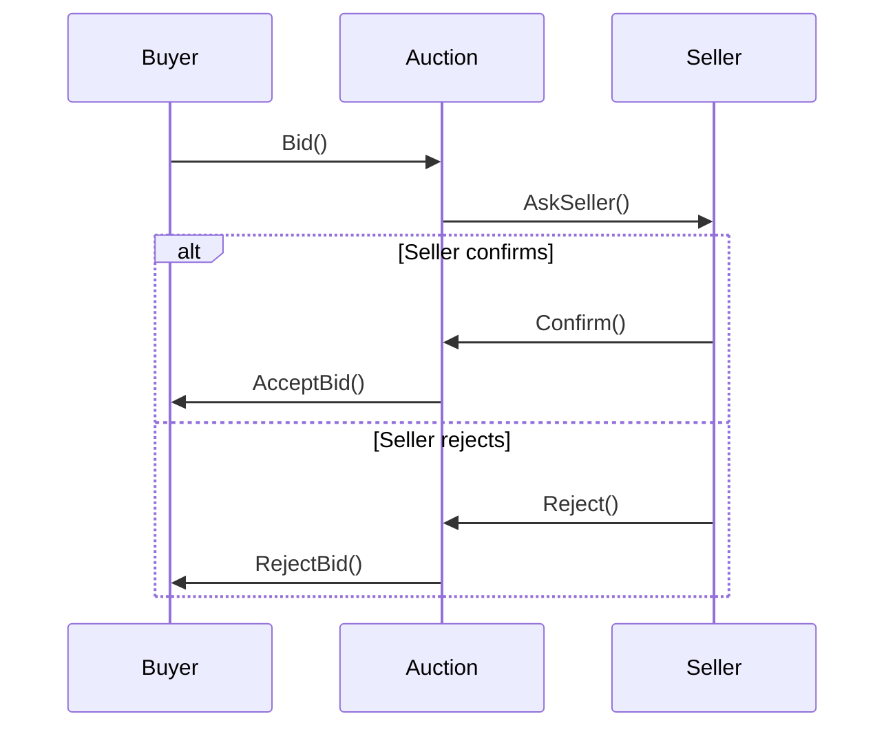

# Bidding Protocol – Sequence Diagram (Buyer ↔ Auction ↔ Seller)

## Mermaid Diagram



## ASCII Diagram (optional)

```
            +----------------+
            |     Buyer     |
            +----------------+
                     |
                     |  Bid()
                     v
            +----------------+
            |    Auction     |
            +----------------+
                     |
                     |  AskSeller()
                     v
            +----------------+
            |     Seller     |
            +----------------+
                 /       \
                /         \
        Confirm()       Reject()
              \           /
               \         /
                v       v
            +----------------+
            |    Auction     |
            +----------------+
                 /       \
                /         \
      AcceptBid()     RejectBid()
                \       /
                 \     /
                  v   v
            +----------------+
            |     Buyer      |
            +----------------+
```
