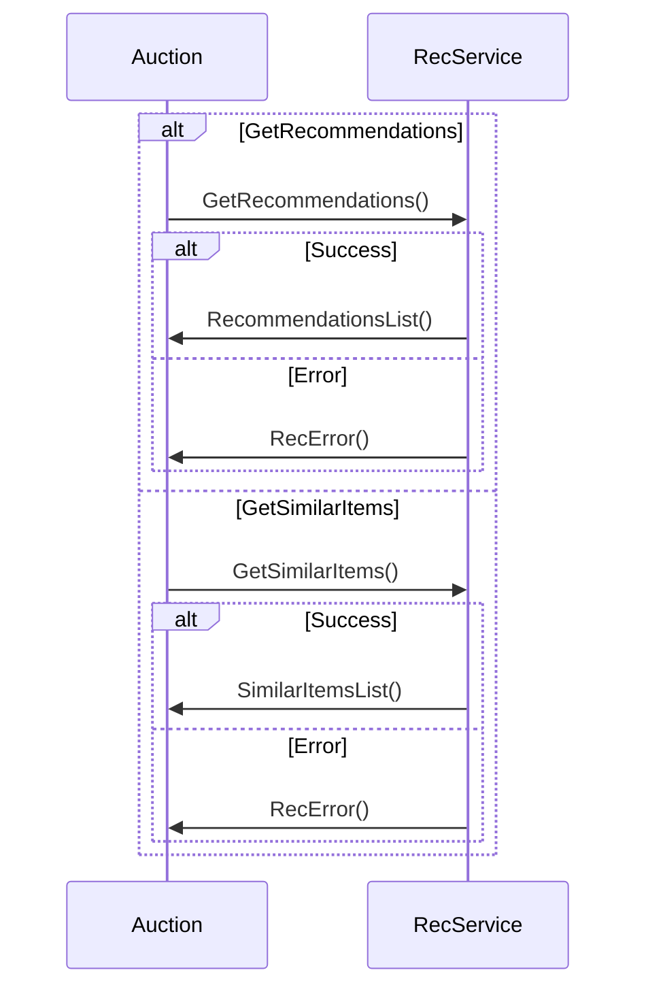

# Recommendation Protocol – Sequence Diagram (Auction ↔ RecService)

## Mermaid Diagram



## ASCII Diagram (optional)

```
            +----------------+
            |    Auction     |
            +----------------+
               /         \
              /           \
   GetRecommendations()   GetSimilarItems()
            |                   |
            v                   v
     +---------------+    +---------------+
     | Rec Service   |    | Rec Service   |
     +---------------+    +---------------+
          /     \               /      \
         /       \             /        \
   RecList()   RecError()  SimilarList()  RecError()
```
